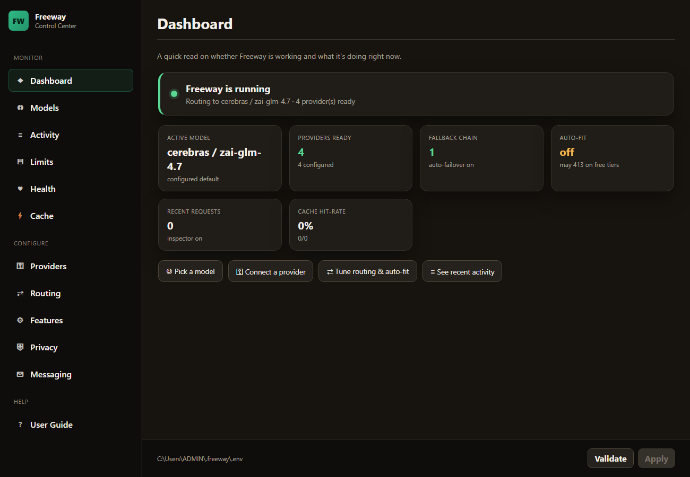
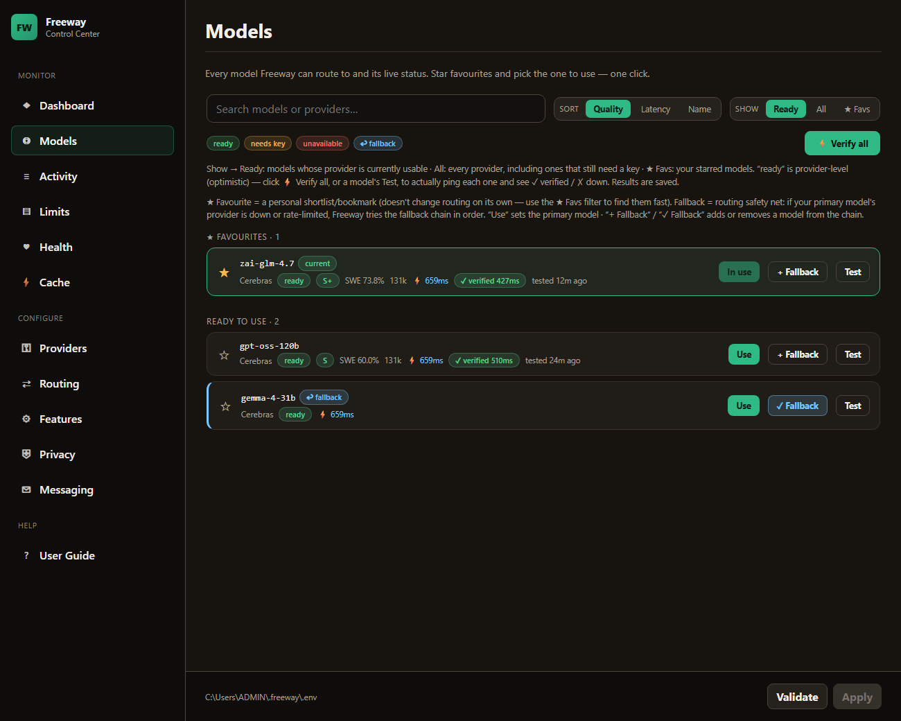
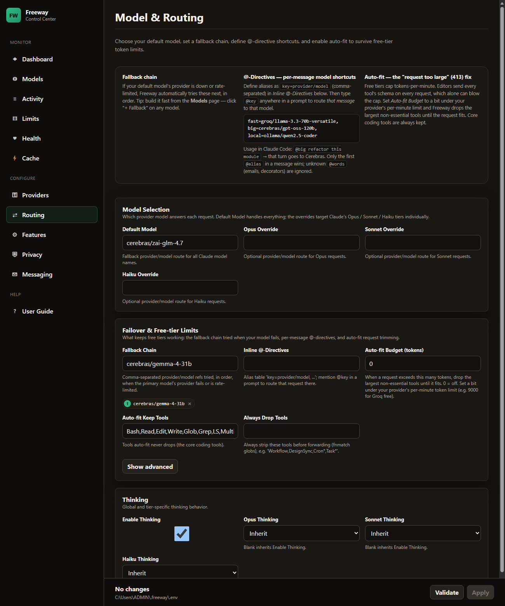
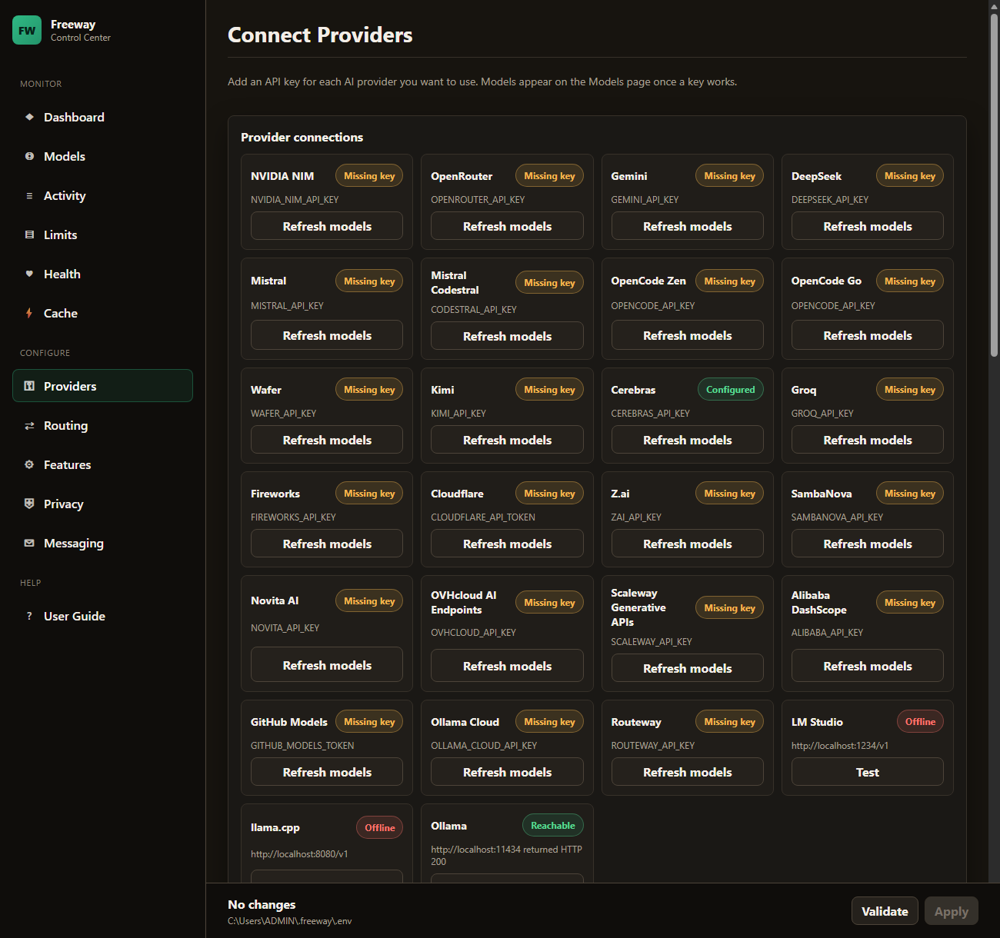
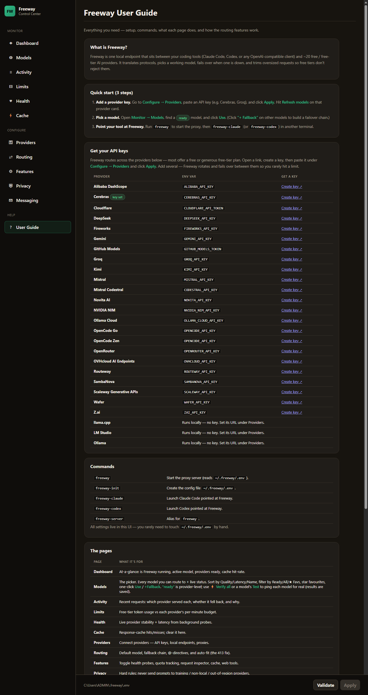

<div align="center">

# 🚗💨 Freeway

### A free, smart route to many AI coding models.

**Freeway is a local gateway that lets [Claude Code](https://claude.com/claude-code), Codex, and any OpenAI‑compatible coding tool run on ~20 free / free‑tier model providers** — routing each request to the fastest healthy model that still has quota, automatically failing over, and trimming oversized requests so "free" actually lasts.

`brand: Freeway` · `command: freeway` · `package: freeway-ai` · MIT licensed

</div>

---

## Why Freeway?

Free AI model tiers are generous but fiddly: every provider speaks a slightly different API, each has its own per‑minute token limit, models go down, and coding tools like Claude Code send *huge* requests (every tool's schema, every turn) that blow past small free budgets with a **`413 request too large`**.

Freeway fixes all of that from **one local endpoint**:

- 🔌 **One endpoint, every tool** — accepts Claude Code's Anthropic protocol *and* Codex's / OpenAI's, and speaks to ~20 providers behind the scenes.
- ⛽ **Make free last** — quota‑aware routing + multi‑key rotation stretch free tiers and route *away* from a provider before it rate‑limits.
- 🧠 **Smart routing** — health/latency/context‑aware model selection with automatic fallback chains and per‑message `@`‑directives.
- 🔬 **Know what's really live** — one‑click per‑model verification pings each model for real (✓ live + latency / ✗ down + reason) and saves the result, so "ready" isn't just a guess.
- 🩹 **Auto‑fit (the 413 fix)** — when a request exceeds a provider's token budget, Freeway trims the largest non‑essential tools until it fits, keeping the core coding tools.
- 🔒 **Trust & glass‑box** — data‑governance rules (never send code to training providers) + a full request inspector so you can *see* every routing decision.
- 🖥️ **Everything in a UI** — a local control center at `/admin` where every setting is editable and every feature is visible. No hand‑editing config files.

---

## Screenshots

**Dashboard** — is Freeway working, and what's it doing right now?



**Models** — every model you can route to, ranked by quality (SWE‑bench) with live status & latency. Sort by Quality / Latency / Name, filter by Ready / All / ★ Favs, star favourites, and pick one (or add fallbacks) with a click. **⚡ Verify all** (or a model's **Test**) pings each model for real and marks it ✓ verified / ✗ down — saved until you re‑check.



**Routing** — default model, fallback chain, `@`‑directive shortcuts, and auto‑fit, all explained inline.



**Providers** — connect providers with a key; models appear on the Models page once a key works.



**User Guide** — a built‑in manual covering setup, every page, and every concept.



---

## Quick start

**1. Install** (installs uv, Python, Claude Code, Codex, and Freeway):

```powershell
# Windows
cd freeway\proxy; .\scripts\install.ps1
```
```bash
# macOS / Linux
cd freeway/proxy && ./scripts/install.sh
```
> Open a **fresh terminal** afterwards so the new `freeway` commands are on your PATH.

**2. Create config & start:**

```bash
freeway-init      # scaffolds ~/.freeway/.env
freeway           # starts the proxy + opens the admin UI (http://localhost:8082/admin)
```

**3. In the admin UI:** add a provider API key on **Providers**, pick a model on **Models** (click *Use*), then point your tool at Freeway:

```bash
freeway-claude    # Claude Code, routed through Freeway
freeway-codex     # Codex, routed through Freeway
```

That's it — you're coding on a free model. If you ever hit a `413`, set **Routing → Auto‑fit Budget** (e.g. `9000`) or pick a higher‑limit provider on the Models page.

---

## The Control Center (`/admin`)

Everything is configurable and observable from one loopback‑only UI served by `freeway` itself:

| Group | Page | What it does |
|---|---|---|
| **Monitor** | Dashboard | Live status: running?, active model, providers ready, cache hit‑rate. |
| | Models | The picker — all routable models with tier/SWE/latency, favourites, sort, filter, one‑click *Use* / *+Fallback*, and per‑model *Verify* (real ping). |
| | Activity | Every request: provider used, was‑fallback, downgrade reason, outcome. |
| | Limits | Free‑tier token usage vs each provider's per‑minute budget. |
| | Health | Live provider stability + latency from background probes. |
| | Cache | Response‑cache hits/misses; clear button. |
| **Configure** | Providers | API keys, local endpoints, proxies. |
| | Routing | Default model, fallback chain, `@`‑directives, auto‑fit. |
| | Features | Toggle health probes, quota tracking, inspector, cache, web tools. |
| | Privacy | Hard data‑governance rules (no‑training / local‑only / region). |
| | Messaging | Optional Discord / Telegram + voice. |
| **Help** | User Guide | Built‑in manual: setup, pages, concepts, troubleshooting. |

---

## Key concepts

- **Favourites vs fallback.** ★ Favourite a model to shortlist it — a bookmark you can isolate with the **★ Favs** filter; it does *not* change routing. **Fallback** is real routing: **+ Fallback** adds a model to the failover chain that's tried, in order, when your primary is unavailable (toggle it off with **✓ Fallback**).
- **Auto‑failover.** If your model's provider is down or rate‑limited, Freeway automatically tries the next model in your chain.
- **`@`‑Directives.** Define aliases like `fast=groq/llama-3.3-70b-versatile, big=cerebras/gpt-oss-120b`, then type `@big refactor this` to route that one message to Cerebras.
- **Auto‑fit.** Set a token budget under your provider's per‑minute limit; Freeway drops the largest non‑essential tools until the request fits (core coding tools always kept).
- **"Ready" vs "Verified".** *Ready* is provider‑level and optimistic (a healthy provider marks all its models ready). *Verified* is a real per‑model ping via **⚡ Verify all** / **Test** — ✓ live + latency or ✗ down + reason, saved until you re‑check. Actual availability is otherwise proven at request time by failover.

---

## Deployment

**Native (both runtimes):** `scripts/install.ps1` / `install.sh` provision uv + Node and install Freeway.

**Docker (whole stack):**
```bash
( cd frontend && corepack pnpm install && corepack pnpm exec vite build )   # build web assets once
docker compose up --build
```
Proxy → `http://localhost:8082` · Frontend dashboard → `http://localhost:19280`. See [`docs/PACKAGING.md`](docs/PACKAGING.md).

---

## Architecture

```
your tool ──Anthropic / OpenAI──▶  Freeway proxy (FastAPI)  ──▶  ~20 providers
(Claude Code / Codex)               • protocol translation        (Groq, Cerebras,
                                     • health / quota / circuit      SambaNova, Gemini,
                                     • fallback + auto-fit            OpenRouter, local…)
                                     • /admin control center
```

- `proxy/` — the data plane (Python / uv / FastAPI). Protocol translation, routing, and the admin UI. Run `uv run pytest` to test.
- `frontend/` — the optional rich dashboard / model catalog (Node / pnpm).
- `docs/` — `ROADMAP.md`, `FEATURE_MERGE_PLAN.md`, `PRODUCT_DIFFERENTIATION.md`, `PACKAGING.md`.

---

## Troubleshooting

| Symptom | Fix |
|---|---|
| `413 request too large` | Set **Routing → Auto‑fit Budget** (e.g. 9000), or switch to a higher‑limit provider on **Models**. |
| Port already in use | Change **Providers → Runtime → PORT** (default 8082) and Apply. |
| "no key" on a provider | Add its API key under **Providers**, Apply, then *Refresh models*. |
| `command not found` after install | Open a fresh terminal (PATH updates apply to new shells only). |
| Config / logs | `~/.freeway/.env` (from `freeway-init`); logs in `~/.freeway/logs/`. |

---

## Credits & Attribution

Freeway is a derivative/combined work built on two MIT‑licensed projects — huge thanks to their authors:

| Upstream | Author | Source |
|---|---|---|
| **free-claude-code** | Ali Khokhar ([@Alishahryar1](https://github.com/Alishahryar1)) | https://github.com/Alishahryar1/free-claude-code |
| **free-coding-models** | vava-nessa ([@vava-nessa](https://github.com/vava-nessa)) | https://github.com/vava-nessa/free-coding-models |

## License

Licensed under the [MIT License](./LICENSE). This project incorporates code from the upstream projects above; their original MIT notices are preserved in [`LICENSES/`](./LICENSES) and continue to apply to their portions. See [`NOTICE`](./NOTICE) for the attribution summary. When redistributing, keep `LICENSE`, `NOTICE`, and `LICENSES/` intact.

## Disclaimer

This is an independent, community‑developed project. It is **not** affiliated with, endorsed by, or sponsored by the upstream authors or by any AI model provider (NVIDIA, Groq, Google, Mistral, Anthropic, OpenAI, etc.). Provider and product names are used only to describe technical compatibility. You are responsible for complying with each provider's Terms of Service and for securing your own API keys.
