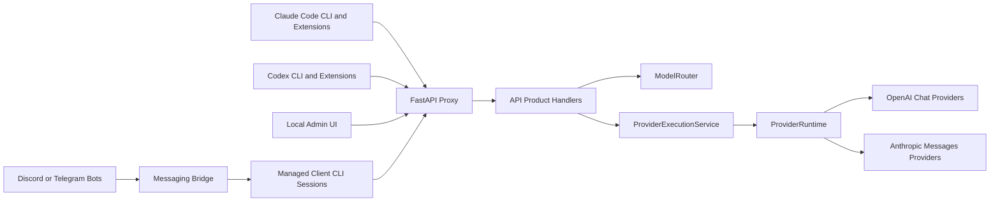
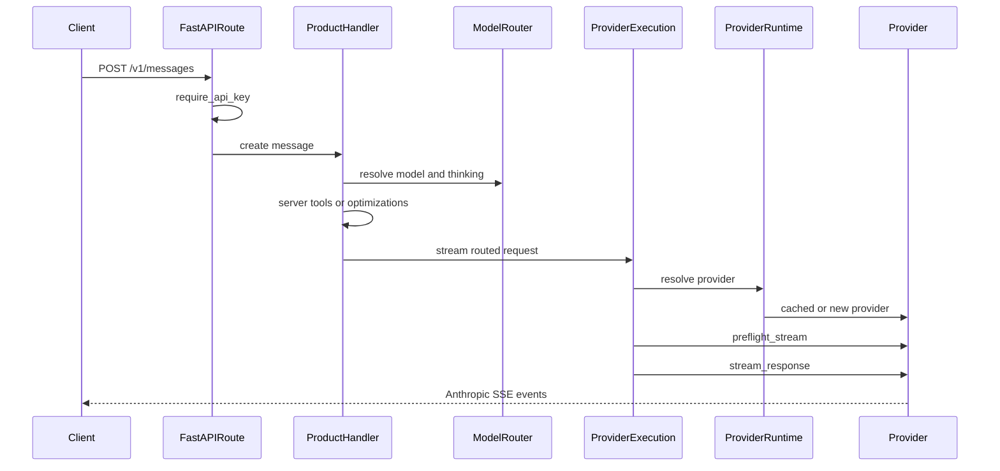
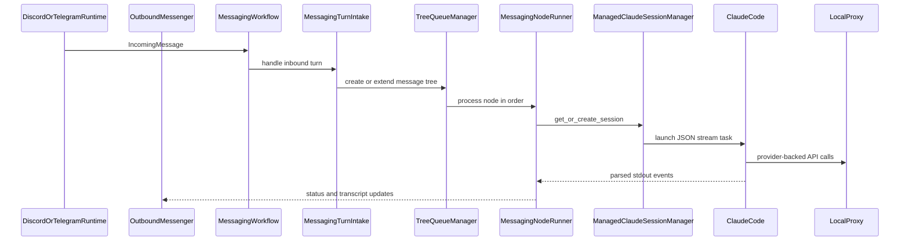

# Architecture

This document is a maintainer-oriented map of Freeway. It explains the
runtime boundaries, request flows, provider abstraction, configuration model,
optional messaging bridge, and verification strategy.

For installation, provider setup, and user-facing usage, see
[README.md](README.md). This file focuses on where behavior lives in the codebase
and how contributors should extend it.

## System Overview

Freeway is a local proxy for agent clients. It accepts Anthropic
Messages traffic from Claude Code clients and OpenAI Responses traffic from Codex
clients, routes the request to a configured upstream provider, and preserves the
wire protocol expected by the caller.

There are three runtime surfaces:

- HTTP proxy: FastAPI routes expose Anthropic-compatible, Responses-compatible,
  health, model-listing, stop, and admin endpoints.
- CLI launchers: wrapper entrypoints prepare Claude Code and Codex environments
  so they target the local proxy.
- Messaging bridge: optional Discord or Telegram adapters turn chat messages
  into managed client CLI sessions.



## Package Boundaries

The installable wheel packages are declared in [pyproject.toml](pyproject.toml):

- [api/](api/) owns the FastAPI app, route handlers, API product handlers, shared
  provider execution, model catalog, admin APIs, local optimizations, and
  server-tool handling.
- [cli/](cli/) owns console entrypoints, client CLI launchers, process/session
  management, and client adapter contracts.
- [config/](config/) owns settings, provider metadata, filesystem paths,
  logging setup, constants, and provider ID catalogs.
- [core/](core/) owns provider-neutral protocol logic: Anthropic conversion,
  SSE construction, OpenAI Responses conversion, stream recovery, token counting,
  and structured trace helpers.
- [messaging/](messaging/) owns optional platform adapters, incoming message
  handling, tree queues, transcript rendering, persistence, commands, and voice
  support.
- [providers/](providers/) owns provider construction, shared provider base
  classes, upstream transports, rate limiting, model listing, and concrete
  provider adapters.

[tests/](tests/) contains deterministic unit and contract coverage.
[smoke/](smoke/) contains local and live product smoke tests that can launch
subprocesses or touch real services.

The main ownership rule is that shared Anthropic and Responses protocol behavior
belongs in [core/](core/). Provider modules should use neutral helpers rather
than importing behavior from another provider-specific module.

## Customer-Facing Contract

Freeway optimizes for installed user workflows, not internal compatibility. The
behavior that must be preserved is that these user-facing surfaces run correctly
for real prompts against supported providers:

- `freeway-server` and the local Admin UI for configuring supported providers,
  model routing, auth, server tools, messaging, and diagnostics.
- `freeway-claude`, Claude Code, and the Anthropic-compatible proxy behavior Claude
  Code relies on, including streaming text, native/interleaved thinking, tool
  use/results, model discovery, token counting, retries/recovery, and supported
  local server-tool behavior.
- `freeway-codex`, Codex CLI/extensions, and the streaming OpenAI Responses behavior
  Codex relies on, including native/interleaved reasoning, function and custom
  tool calls, generated `/model` catalog support, Responses stream lifecycle
  events, and Responses-to-Anthropic conversion at the adapter boundary.
- Configured Discord and Telegram messaging bridges, including command handling,
  reply-based conversation branches, status updates, transcript rendering,
  managed Claude/Codex task execution where configured, task stop/clear flows,
  persistence, and optional voice-note transcription.
- Installation, update, init, and uninstall scripts insofar as they make the
  above workflows available on a user's machine.

Internal modules, class designs, helper APIs, route implementations, and tests
are not stable contracts. Refactors may replace or remove them when doing so
simplifies the system, improves correctness, or better matches these
architecture boundaries. When tests primarily encode an obsolete internal shape,
update the tests to assert the customer-facing behavior instead. Features,
compatibility shims, endpoints, or helper paths that do not serve one of the
surfaces above are not product requirements and should be removed rather than
preserved.

## Design Pressure And Refactor Targets

The current package boundaries are intentional, but several modules still carry
large orchestration responsibilities. Treat these as refactor targets, not as
new places to add unrelated behavior:

- [api/handlers/](api/handlers/) owns customer-facing API product flows:
  Claude Messages, OpenAI Responses, and token counting. Keep route handlers
  thin, keep Claude-only behavior in the Messages handler, and use
  [api/provider_execution.py](api/provider_execution.py) only for shared
  provider resolution, preflight, tracing, token counting, and streaming.
- [providers/transports/](providers/transports/) owns provider transport
  families. The OpenAI-chat and native Anthropic transport packages split thin
  transport bases from per-request stream runners, recovery event construction,
  request policy, and transport-specific parsing. Shared protocol rules should
  continue moving toward [core/](core/) when they are not provider-specific.
- [messaging/workflow.py](messaging/workflow.py) coordinates messaging runtime
  dependencies. Inbound turn intake, queued node execution, slash command
  dependencies, and tree queue internals live in separate modules so new
  behavior has one owner instead of growing the workflow object.
- [api/admin_config/](api/admin_config/) owns Admin UI config behavior. Keep
  provider fields catalog-driven, and keep manifest, source loading, validation,
  env rendering, value presentation, and status metadata in their package owners.

## Runtime Startup And Lifecycle

Console scripts are registered in [pyproject.toml](pyproject.toml):

- `freeway-server` and `free-claude-code` call `cli.entrypoints:serve`.
- `freeway-init` calls `cli.entrypoints:init`.
- `freeway-claude` calls `cli.launchers.claude:launch`.
- `freeway-codex` calls `cli.launchers.codex:launch`.

[scripts/install.sh](scripts/install.sh) and [scripts/install.ps1](scripts/install.ps1)
install or update the uv tool plus optional voice extras. [scripts/uninstall.sh](scripts/uninstall.sh)
and [scripts/uninstall.ps1](scripts/uninstall.ps1) remove only the Freeway uv tool and always
delete the managed `~/.freeway/` tree from [config/paths.py](config/paths.py); they do not remove
uv, Claude Code, Codex, or uv-managed Python runtimes. [scripts/ci.sh](scripts/ci.sh) and
[scripts/ci.ps1](scripts/ci.ps1) mirror [.github/workflows/tests.yml](.github/workflows/tests.yml)
for local pre-push verification.

[cli/entrypoints.py](cli/entrypoints.py) starts the FastAPI server with Uvicorn.
`serve()` migrates legacy env files when needed, loads cached settings, runs a
supervised server instance, and can restart the server after admin config changes.
On final shutdown it best-effort kills registered child processes.

[api/app.py](api/app.py) builds the FastAPI application. `create_app()` configures
logging, registers admin and API routers, attaches HTTP correlation metadata, and
installs exception handlers for validation failures, provider errors, and
unexpected errors. `GracefulLifespanApp` wraps the app so startup failures are
reported without noisy Starlette tracebacks.

[api/runtime.py](api/runtime.py) owns process-lifetime resources through
`AppRuntime`:

- creates and publishes an app-scoped `ProviderRuntime`;
- validates configured models best-effort without blocking first-run admin access;
- starts provider model-list refresh;
- starts optional Discord or Telegram messaging when configured;
- publishes messaging, CLI, and provider state onto `app.state`;
- shuts down messaging platforms, CLI sessions, provider transports, and rate
  limiters with bounded best-effort cleanup.

## Configuration Model

[config/settings.py](config/settings.py) owns the flat Pydantic Settings schema:
raw env fields, validation, and `get_settings()`. It should not own routing,
model-ref parsing, launcher defaults, or web-tool policy. Dotenv discovery lives
in [config/env_files.py](config/env_files.py) and uses this order:

1. repo-local `.env`;
2. managed `~/.freeway/.env`;
3. optional `FCC_ENV_FILE`, appended when present.

Later dotenv files override earlier dotenv files. Process environment variables
also participate through Pydantic settings resolution. `ANTHROPIC_AUTH_TOKEN`
has an extra guard after settings are built: if any configured dotenv file
defines it, that dotenv value replaces a stale inherited shell token. Auth-token
source detection for startup warnings also belongs to `config/env_files.py`.

[config/paths.py](config/paths.py) defines managed paths:

- config directory: `~/.freeway`;
- managed env file: `~/.freeway/.env`;
- generated Codex model catalog: `~/.freeway/codex-model-catalog.json`;
- agent workspace: `~/.freeway/agent_workspace`;
- server log: `~/.freeway/logs/server.log`.

Model routing configuration is tiered:

- `MODEL` is the fallback provider-prefixed model ref.
- `MODEL_OPUS`, `MODEL_SONNET`, and `MODEL_HAIKU` override Claude model tiers.
- `ENABLE_MODEL_THINKING` is the global thinking switch.
- `ENABLE_OPUS_THINKING`, `ENABLE_SONNET_THINKING`, and
  `ENABLE_HAIKU_THINKING` optionally override thinking by tier.

[config/model_refs.py](config/model_refs.py) owns provider-prefixed model ref
parsing and configured `MODEL*` inventory. API routing and provider validation
depend on those helpers instead of adding behavior methods to Settings.

[api/admin_config/](api/admin_config/) owns the Admin UI config manifest and
managed env writes. Provider credential, local URL, proxy, and display-name
metadata is generated from [config/provider_catalog.py](config/provider_catalog.py);
admin-only help text stays beside the admin manifest. The package splits source
loading, value presentation, validation, persistence, and provider status into
separate modules. [api/admin_routes.py](api/admin_routes.py) exposes local-only
admin endpoints that load, validate, apply, and test config. After an apply,
settings are cache-cleared. Depending on the changed fields, the server either
replaces the app provider runtime or asks the supervised server to restart.

[.env.example](.env.example) is the single install/init/admin template source.
It is packaged as a [config/](config/) resource for `freeway-init` and Admin UI
template defaults; runtime settings do not read it as a live config file.

Admin routes call `require_loopback_admin()`, which rejects non-loopback clients
and non-local origins.

## HTTP Request Flow

[api/routes.py](api/routes.py) exposes the public proxy routes:

- `POST /v1/messages`: Anthropic Messages-compatible streaming requests.
- `POST /v1/responses`: OpenAI Responses-compatible requests.
- `POST /v1/messages/count_tokens`: Anthropic token counting.
- `GET /v1/models`: gateway and Claude-compatible model listing.
- `GET /health`: health check.
- `POST /stop`: stop CLI sessions and pending tasks.
- `HEAD` and `OPTIONS` probes for compatibility on supported endpoints.

Admin routes live beside these in [api/admin_routes.py](api/admin_routes.py).

Authentication is handled by `require_api_key()` in
[api/dependencies.py](api/dependencies.py). If `ANTHROPIC_AUTH_TOKEN` is blank,
proxy auth is disabled. Otherwise the token may be supplied through `x-api-key`,
`Authorization: Bearer ...`, or `anthropic-auth-token`. Comparisons use
constant-time matching.

[api/handlers/](api/handlers/) owns the public API product flows.
`MessagesHandler` validates non-empty messages, resolves models, applies
Claude-only safety-classifier and local optimization policy, handles local web
server tools, then streams Anthropic SSE. `ResponsesHandler` owns streaming-only
OpenAI Responses validation and conversion for Codex clients. `TokenCountHandler`
owns Anthropic token counting. Shared provider execution lives in
[api/provider_execution.py](api/provider_execution.py), which resolves a
provider, preflights the upstream request, emits trace events, counts input
tokens, and returns an Anthropic SSE iterator.



OpenAI Responses uses the same provider execution primitive without importing
Claude-only message intercepts. `ResponsesHandler` delegates protocol work to
the `OpenAIResponsesAdapter` in
[core/openai_responses/adapter.py](core/openai_responses/adapter.py). The adapter
converts the Responses payload into an Anthropic Messages payload before
provider execution, then converts Anthropic SSE back to Responses SSE.

## Model Routing

[api/model_router.py](api/model_router.py) resolves incoming client model names.
It supports two forms:

- Direct provider model refs such as `nvidia_nim/nvidia/model-name`.
- Gateway model IDs decoded by [api/gateway_model_ids.py](api/gateway_model_ids.py).

If the incoming model is not direct, `ModelRouter` maps it by Claude tier. Names
containing `opus`, `sonnet`, or `haiku` use the matching tier override when set,
otherwise they fall back to `MODEL`.

The router also resolves thinking. Gateway model IDs can force thinking on or
off; otherwise `ModelRouter` applies tier-specific thinking overrides or the
global setting.

`GET /v1/models` advertises:

- configured provider model refs;
- cached provider-discovered models;
- no-thinking variants when appropriate;
- built-in Claude model IDs for compatibility with Claude clients.

Provider model discovery is app-scoped through `ProviderRuntime`, which caches
model IDs and optional thinking capability metadata for the model-list route and
admin status.

Codex-specific model picker shaping stays out of this route. `freeway-codex` fetches
the same `/v1/models` response at launch, converts Freeway gateway IDs into
provider-selectable Codex slugs, writes `~/.freeway/codex-model-catalog.json`, and
passes it as `model_catalog_json`. Codex users open the native picker with
`/model`; Freeway does not implement a proxy-level `/models` alias.

## Provider Architecture

Provider metadata is neutral and centralized in
[config/provider_catalog.py](config/provider_catalog.py). Each
`ProviderDescriptor` declares provider ID, transport type, capabilities,
credential env var, default base URL, settings attribute names, and proxy support.

[providers/runtime/](providers/runtime/) owns the app-scoped provider runtime.
It validates that descriptors, factories, and supported IDs are in sync, builds
shared `ProviderConfig`, checks required credentials, creates providers lazily,
caches them, refreshes model lists, validates configured models, and cleans up
transports. The package splits factory wiring, config building, provider instance
cache, model metadata cache, discovery, and validation into separate modules.

[providers/base.py](providers/base.py) defines:

- `ProviderConfig`: shared provider settings such as API key, base URL, rate
  limits, timeouts, proxy, thinking, and logging flags.
- `BaseProvider`: the provider interface for cleanup, model listing, preflight,
  and `stream_response()`.

There are two transport families under [providers/transports/](providers/transports/):

- [providers/transports/openai_chat/](providers/transports/openai_chat/)
  implements `OpenAIChatTransport` for providers with OpenAI-compatible
  `/chat/completions` APIs. The package owns the thin transport base,
  per-request stream runner, OpenAI request policy, OpenAI tool-call assembly,
  and OpenAI-chat recovery event construction.
- [providers/transports/anthropic_messages/](providers/transports/anthropic_messages/)
  implements `AnthropicMessagesTransport` for providers with
  Anthropic-compatible `/messages` APIs. The package owns the thin transport
  base, native request policy, native stream runner, HTTP response helpers, and
  native recovery event construction.

Provider request construction mirrors the transport family split. OpenAI-chat
providers call the OpenAI request policy for Anthropic-to-OpenAI conversion,
thinking replay selection, `extra_body`, and chat-completion field normalization.
Native Anthropic providers call the native request policy for raw request
dumping, default tokens, stream flags, thinking payloads, and `extra_body`
handling. Concrete provider packages keep only true upstream quirks such as
Gemini thought signatures, NIM tool-schema aliases and retry downgrades, or
DeepSeek attachment/tool/thinking compatibility. DeepSeek intentionally uses its
OpenAI-compatible Chat Completions endpoint because that is the endpoint that
reports prompt-cache hit/miss counters; the provider maps those counters back
into Anthropic usage fields for Claude-compatible clients.

Shared provider responsibilities include upstream rate limiting, model listing,
safe error mapping, transport cleanup, thinking/tool handling, retry or recovery
where supported, and returning Anthropic SSE strings to the service layer.
Provider-specific inputs that do not apply to other upstreams, such as
Cloudflare's account ID, stay in that provider's factory/client instead of being
added to shared `ProviderConfig`.

### Adding A Provider

1. Add provider metadata to [config/provider_catalog.py](config/provider_catalog.py).
2. Add credentials and related settings to [config/settings.py](config/settings.py)
   and [.env.example](.env.example) when user configurable.
3. Let Admin UI provider credential, local URL, and proxy fields come from the
   catalog. Add admin-only help text or provider-specific fields under
   [api/admin_config/](api/admin_config/) only when the generated manifest is
   insufficient.
4. Implement the provider under [providers/](providers/) using the appropriate
   shared transport family.
5. Add a factory in [providers/runtime/factory.py](providers/runtime/factory.py).
6. Add deterministic tests under [tests/providers/](tests/providers/) and any
   relevant contract tests.
7. Add smoke coverage or smoke config in [smoke/](smoke/) when the provider can
   be exercised live.
8. Update user-facing provider docs in [README.md](README.md) when users need new
   setup instructions.

## Protocol Conversion And Streaming Contracts

[core/anthropic/](core/anthropic/) owns Anthropic-side protocol behavior:

- content and message conversion for OpenAI-compatible upstreams;
- request serialization primitives shared by provider request policies;
- tool schema and tool-result handling;
- thinking block handling;
- stream lifecycle through `core/anthropic/streaming`, including the neutral
  stream ledger, Anthropic SSE emitter, native event normalization, retry
  holdback, continuation, and tool repair;
- native Anthropic stream policy;
- token counting and user-facing error formatting.

Shared stream behavior lives under
[core/anthropic/streaming/](core/anthropic/streaming/). The shared layer owns the
Anthropic content-block ledger, SSE serialization, early retry classification,
holdback buffering, retry attempt counting, common flush/discard behavior,
midstream continuation, tool JSON repair, and final success/error tails. Provider
transport packages are upstream adapters: OpenAI-chat providers convert chat
chunks into ledger operations, and native Anthropic providers parse upstream SSE,
apply native block policy, and re-emit normalized Anthropic SSE from the shared
ledger. Transport bases stay focused on provider hooks, client setup, request
construction, rate limiting, and model listing.

[core/openai_responses/](core/openai_responses/) owns OpenAI Responses support:

- the `OpenAIResponsesAdapter` facade used by the API layer;
- streaming-only `/v1/responses` support for Codex/Freeway workflows;
- Responses request conversion into Anthropic Messages payloads;
- Anthropic SSE conversion into Responses SSE;
- OpenAI-compatible error envelopes.

The package intentionally does not implement the full OpenAI Responses surface.
Freeway accepts omitted `stream` or `stream: true`; `stream: false` is rejected with
an OpenAI-shaped client error because installed Freeway/Codex workflows only need
streaming. Request conversion, stream transformation, Anthropic SSE parsing,
Responses SSE event formatting, output item construction, tool identity mapping,
reasoning mapping, ID generation, and error envelope construction each live
behind the adapter boundary. `stream.py` is the public streaming entrypoint;
[core/openai_responses/streaming/](core/openai_responses/streaming/) owns the
block-indexed Responses stream assembler. The package separates Anthropic SSE
dispatch, block state, output ledger ordering, block completion, SSE event
builders, and error mapping. API code should depend on the adapter, not on
those internal module owners directly. Responses output payloads stay
OpenAI-shaped; Anthropic terminal metadata is used internally only when it
affects streamed behavior.

Responses custom tools are also boundary-owned. The adapter accepts native
Responses `custom` tool declarations, represents them internally as Anthropic
tools with a single string `input` field, and restores `custom_tool_call`,
`custom_tool_call_output`, and `response.custom_tool_call_input.*` shapes at the
Responses edge. Text or grammar format metadata is preserved as model guidance;
Freeway does not validate custom-tool grammars.

Responses reasoning is handled as protocol conversion, not provider policy.
`reasoning.effort = "none"` converts to a disabled Anthropic `thinking`
request; any other explicit Responses reasoning request enables Anthropic
thinking without translating OpenAI effort names into Anthropic token budgets.
Prior Responses `reasoning` input items replay plaintext `reasoning_text`, or
fallback `summary_text`, into assistant `reasoning_content`. Encrypted reasoning
input is ignored because the proxy cannot decrypt it.

Provider thinking output maps back to Responses reasoning in the same block
order the upstream Anthropic stream produced. Anthropic `thinking` blocks become
Responses `reasoning` output items and `response.reasoning_text.*` stream
events. Anthropic `redacted_thinking` becomes a Responses `reasoning` item with
`encrypted_content`; the opaque value is not exposed as visible text and Freeway
does not synthesize reasoning summaries.

Provider code should delegate protocol details to these modules. Avoid copying
conversion code into individual providers, and avoid provider-to-provider imports
for shared Anthropic behavior.

## Local Optimizations And Server Tools

[api/optimization_handlers.py](api/optimization_handlers.py) short-circuits
common low-value client requests before they reach a provider:

- quota probes;
- command prefix detection;
- title generation;
- suggestion mode;
- filepath extraction.

The Messages handler runs these only after model routing and after local server-tool
handling. Each optimization is controlled by settings flags.

Claude Code auto-mode safety-classifier requests are a message-only routing
policy, not a short-circuit response. After routing, the Messages handler detects the
narrow classifier prompt shape and forces thinking off before provider execution
so Claude Code receives a parser-readable `<block>yes</block>` or
`<block>no</block>` verdict.

Local `web_search` and `web_fetch` handling lives under
[api/web_tools/](api/web_tools/). When `ENABLE_WEB_SERVER_TOOLS` is true, the
Messages handler can stream local Anthropic server-tool responses without sending the
request upstream. [api/web_tools/egress.py](api/web_tools/egress.py) enforces URL
scheme and private-network restrictions for `web_fetch`.

OpenAI-chat upstream providers are identified by
`ProviderDescriptor.transport_type == "openai_chat"` in
[config/provider_catalog.py](config/provider_catalog.py). They cannot safely
represent Anthropic server-tool blocks, so the Messages handler rejects unsupported
server-tool requests before provider execution instead of performing a lossy
conversion. Forced `web_search` or `web_fetch` requests are handled locally when
`ENABLE_WEB_SERVER_TOOLS` is true; otherwise OpenAI-chat upstreams reject them
and native Anthropic Messages transports may receive them.

## CLI Launchers And Managed Claude

[cli/launchers/claude.py](cli/launchers/claude.py) owns the installed
`freeway-claude` launcher:

- `freeway-claude` strips inherited `ANTHROPIC_*` variables, sets
  `ANTHROPIC_BASE_URL`, enables gateway model discovery, configures the
  auto-compact window, and always sets `ANTHROPIC_AUTH_TOKEN`. Blank proxy auth
  becomes the local-only `freeway-no-auth` sentinel so Claude Code reaches the proxy
  instead of stopping at its login gate.

[cli/launchers/codex.py](cli/launchers/codex.py) owns the installed
`freeway-codex` launcher:

- `freeway-codex` strips official OpenAI and Codex credential variables.
- It creates an ephemeral `freeway` model provider with `wire_api = "responses"` and
  a base URL pointing at the local proxy `/v1` path.
- After proxy health succeeds, it fetches `/v1/models`, writes a generated Codex
  `model_catalog_json` file under `~/.freeway/`, and injects that path so Codex's
  native `/model` picker lists Freeway provider slugs. Catalog generation is
  fail-open: launch continues with a warning if the catalog cannot be prepared.
- It stores the proxy auth token in `FREEWAY_CODEX_API_KEY` for Codex to read.

[cli/managed/](cli/managed/) owns managed Claude Code subprocesses used by
Discord and Telegram messaging. Managed task invocations set
`ANTHROPIC_API_URL`, `ANTHROPIC_BASE_URL`, gateway model discovery,
non-interactive terminal settings, optional `--resume`, optional
`--fork-session`, and `--output-format stream-json`. The managed session parser
extracts persistent Claude session IDs and yields Claude stream-json events to
the messaging event parser.

Codex is supported through `freeway-codex` and Codex extensions. Freeway does not keep an
internal managed-Codex session runner because no user-facing messaging setting
selects Codex for Discord or Telegram.

## Messaging Architecture

Messaging is optional. [api/runtime.py](api/runtime.py) calls
`create_messaging_components()` from
[messaging/platforms/factory.py](messaging/platforms/factory.py) during startup.
If `MESSAGING_PLATFORM` is `none`, or if the selected platform token is missing,
the messaging bridge is skipped.

The platform factory returns a `MessagingPlatformComponents` bundle from
[messaging/platforms/ports.py](messaging/platforms/ports.py): a
`MessagingRuntime` for lifecycle and inbound callbacks, an `OutboundMessenger`
for queued sends/edits/deletes, and an optional `VoiceCancellation` port for
reply-scoped `/clear` during voice transcription. Workflow code depends on
these ports, not on Telegram or Discord SDK objects.

Runtime adapters in
[messaging/platforms/telegram.py](messaging/platforms/telegram.py) and
[messaging/platforms/discord.py](messaging/platforms/discord.py) own SDK client
lifecycle, event subscription, inbound handoff, and voice-note handoff. Inbound
normalization lives in
[messaging/platforms/telegram_inbound.py](messaging/platforms/telegram_inbound.py)
and [messaging/platforms/discord_inbound.py](messaging/platforms/discord_inbound.py).
Outbound SDK calls live in
[messaging/platforms/telegram_io.py](messaging/platforms/telegram_io.py) and
[messaging/platforms/discord_io.py](messaging/platforms/discord_io.py). Shared
delivery policy lives in [messaging/platforms/outbox.py](messaging/platforms/outbox.py),
which owns queued send/edit/delete, dedup keys, limiter delegation, and
fire-and-forget behavior.
Shared voice-note orchestration lives in
[messaging/platforms/voice_flow.py](messaging/platforms/voice_flow.py), which owns
pending voice registration, temp-file cleanup, transcription, cancellation, error
replies, and the handoff to `IncomingMessage`.

[messaging/workflow.py](messaging/workflow.py) contains `MessagingWorkflow`, the
platform-agnostic coordinator. It owns dependencies, callback wiring, stop/clear
side effects, render settings, and shutdown-visible state.

[messaging/turn_intake.py](messaging/turn_intake.py) owns inbound message
recording, slash command dispatch, status-echo filtering, reply resolution, tree
creation/extension, initial status messages, persistence, and enqueueing.

[messaging/node_runner.py](messaging/node_runner.py) owns managed CLI session
lifecycle for queued nodes: parent-session fork/resume, session registration,
CLI event parsing, transcript/status updates, cancellation, error propagation,
and session cleanup.

[messaging/event_parser.py](messaging/event_parser.py) normalizes managed Claude
JSON events into low-level transcript events.
[messaging/transcript/](messaging/transcript/) owns transcript assembly and
rendering: open content-block tracking, Task/subagent display state, segment
models, render context, and truncation. Platform markdown details stay in
[messaging/rendering/](messaging/rendering/).

[messaging/command_context.py](messaging/command_context.py) defines the typed
dependency surface for `/stop`, `/clear`, and `/stats`; commands should not
depend on the concrete workflow object or on platform SDK runtimes.

[messaging/trees/manager.py](messaging/trees/manager.py) preserves
per-conversation ordering with tree-aware queues. Replies become child nodes, and
each tree processes one node at a time while separate trees can progress
independently. [messaging/trees/repository.py](messaging/trees/repository.py)
owns the in-memory tree/node index, and
[messaging/trees/processor.py](messaging/trees/processor.py) owns async queue
processing. [messaging/trees/node.py](messaging/trees/node.py) owns
`MessageNode` and `MessageState`,
[messaging/trees/graph.py](messaging/trees/graph.py) owns parent/child and
status-message lookup state, [messaging/trees/runtime.py](messaging/trees/runtime.py)
owns locks/current-task/processing state, and
[messaging/trees/snapshot.py](messaging/trees/snapshot.py) owns typed persisted
conversation snapshots.

[messaging/session/](messaging/session/) persists typed conversation snapshots
and message IDs to a JSON file under the managed agent workspace.
`SessionStore` reads existing `sessions.json` files but exposes typed snapshot
APIs to runtime code. Debounced atomic writes live in
[messaging/session/persistence.py](messaging/session/persistence.py), and
per-chat message ID tracking for `/clear` lives in
[messaging/session/message_log.py](messaging/session/message_log.py).



## Observability, Diagnostics, And Safety

[core/trace.py](core/trace.py) emits structured trace events across stages such
as ingress, routing, provider, egress, messaging, and client CLI execution. Trace
payloads are intended to connect API, provider, CLI, and messaging activity
without requiring raw transport logs by default.

Logging defaults are conservative:

- API payloads and SSE events are not logged raw unless explicitly enabled.
- Provider and application errors log metadata by default; verbose traceback and
  message logging are opt-in.
- Messaging text, transcription previews, CLI diagnostics, and detailed
  messaging exception strings are controlled by separate diagnostic flags.
- Values under keys that look like API keys, authorization, tokens, or secrets
  are redacted by trace helpers where structured traces are emitted.

Important safety boundaries:

- Admin UI and admin APIs are loopback-only.
- Proxy API auth is controlled by `ANTHROPIC_AUTH_TOKEN`.
- `web_fetch` egress defaults to configured URL schemes and blocks private
  network targets unless explicitly allowed.
- Local provider URLs are user-configurable, but local-provider status checks are
  exposed only through the local admin API.

## Testing And CI Strategy

Deterministic tests live under [tests/](tests/). They cover API routes, config,
provider conversion, provider transports, streaming contracts, messaging, CLI
adapters, import boundaries, provider catalog contracts, and other invariants.

Live and local product tests live under [smoke/](smoke/). See
[smoke/README.md](smoke/README.md) for target taxonomy, environment variables,
failure classes, and examples. Smoke tests can launch subprocesses, call real
providers, touch local model servers, and optionally send bot messages.

CI is defined in [.github/workflows/tests.yml](.github/workflows/tests.yml). It
enforces:

- `Ban type ignore suppressions`;
- `ruff-format`;
- `ruff-check`;
- `ty`;
- `pytest`.

Contributor verification commands:

```powershell
uv run ruff format
uv run ruff check
uv run ty check
uv run pytest
```

For docs-only architecture changes, a source-link and accuracy review is usually
sufficient. Full CI can still be run when the doc accompanies runtime changes or
when maintainers want branch-level assurance.

## Extension Checklists

### Add An Admin Setting

1. Add or expose the setting in [config/settings.py](config/settings.py).
2. Add the template key to [.env.example](.env.example) if users configure it.
3. Add a `ConfigFieldSpec` under [api/admin_config/](api/admin_config/), or add
   provider catalog metadata when the setting is provider credential, local URL,
   proxy, or display-name metadata.
4. Mark `restart_required` or `session_sensitive` when runtime state cannot be
   updated in place.
5. Add tests under [tests/api/](tests/api/) or [tests/config/](tests/config/).

### Add Or Change A Client Surface

1. For an installed wrapper, add or update a launcher under
   [cli/launchers/](cli/launchers/) and keep credential stripping local to that
   client.
2. For messaging-managed execution, update [cli/managed/](cli/managed/) only
   when Discord or Telegram should actually run a different managed client.
3. Ensure managed task parsing emits the event shapes expected by
   [messaging/event_parser.py](messaging/event_parser.py) and
   [messaging/node_event_pipeline.py](messaging/node_event_pipeline.py).
4. Add launcher, managed-session, and customer-flow tests under
   [tests/cli/](tests/cli/) and [tests/messaging/](tests/messaging/).

### Add A Messaging Platform

1. Implement a `MessagingRuntime`, `OutboundMessenger`, and inbound normalizer
   under [messaging/platforms/](messaging/platforms/).
2. Reuse [messaging/platforms/outbox.py](messaging/platforms/outbox.py) for
   queued outbound delivery and
   [messaging/platforms/voice_flow.py](messaging/platforms/voice_flow.py) for
   voice-note handoff when the platform supports audio.
3. Add construction logic to
   [messaging/platforms/factory.py](messaging/platforms/factory.py).
4. Add settings and admin fields for tokens, allowlists, and platform-specific
   runtime options.
5. Add rendering profile support in
   [messaging/rendering/profiles.py](messaging/rendering/profiles.py) if needed.
6. Add deterministic runtime/outbound/workflow tests and optional live smoke
   targets.

### Add Protocol Behavior

1. Put shared Anthropic behavior under [core/anthropic/](core/anthropic/).
2. Put OpenAI Responses behavior under
   [core/openai_responses/](core/openai_responses/).
3. Keep provider-specific request quirks inside the provider module or transport
   subclass.
4. Add stream contract tests under [tests/contracts/](tests/contracts/) or
   [tests/core/](tests/core/) when event shape or ordering changes.
5. Add provider tests when the behavior changes upstream request or response
   handling.

## Maintenance Rules For This Document

Update this file when a change adds or meaningfully changes:

- a top-level package or installable runtime boundary;
- a public route or wire protocol;
- startup, shutdown, or resource ownership;
- configuration precedence or managed config behavior;
- provider runtime, catalog, or transport architecture;
- model routing or thinking behavior;
- CLI adapter behavior;
- messaging platform behavior;
- protocol conversion or streaming contracts;
- CI, smoke, or verification strategy.

Docs-only changes to this file do not require a semver bump. Production code
changes still follow the versioning rules in [AGENTS.md](AGENTS.md) and
[CLAUDE.md](CLAUDE.md).

